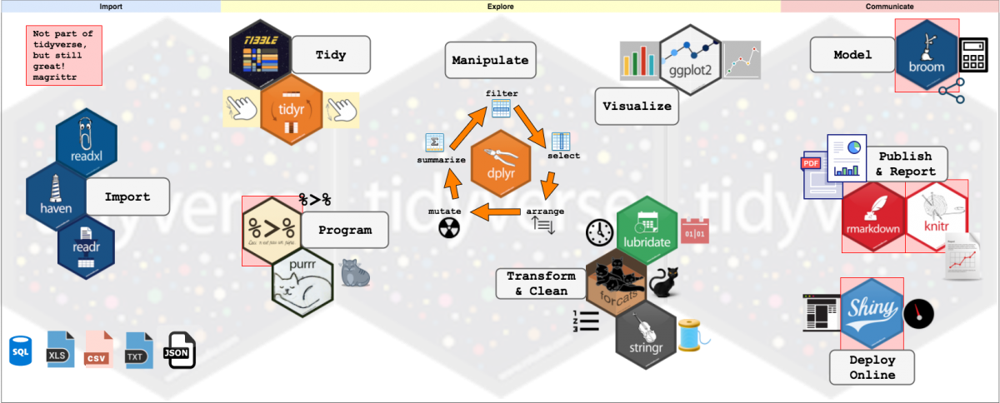

---
title: "Ciência de Dados: Capacitação In-Company"
author: "Dan Reznik, Founder, Data Science Consulting"
output:
  html_document:
    toc: true
    toc_depth: 1
    number_sections: false
    toc_float:
      collapsed: false
      smooth_scroll: true
    css: styles.css
--- 

```{r setup, include=FALSE}
knitr::opts_chunk$set(echo = TRUE)
```
***

# Ciência de Dados

A Ciência de Dados é um conjunto de metodologias e ferramentas de software focados na geração de valor a partir de seus dados. Isto se dá por meio de dashboards, relatórios analíticos (automatizados), modelos preditivos etc., que apoiando decisões de negócio visam (1) aumentar a receita, (2) diminuir os custos, ou (3) gerenciar riscos. 

O seu fluxo de trabalho (abaixo) consiste em (0) um problema de negócios, (1) acesso ao dados, (2) "wrangling" (preparo), (3) exploração e visualização, opcionalmente (4) modelagem estatística e finalmente (5) comunicação: produção de relatórios, dashboards, ou APIs de modelos.

```{r,echo=F,fig.align='center',out.width="100%"}
knitr::include_graphics("pics/fluxo.png")
```

## Foco em R

Somos entusiastas do ecossistema R/Tidyverse/RMarkdown/Shiny, que dispõe de uma coleção estado-da-arte de pacotes p/ implementação elegante e eficaz de todas as demandas em Ciência de Dados:

```{r,echo=F,fig.align='center',out.width="100%"}

```


# Instrutor


```{r,echo=F,fig.align='center',out.width="50%"}
knitr::include_graphics("pics/dan_mp.jpg")
```

Sou fundador da [DCS](index.html) e ex-Cientista de Dados da Microsoft.  Desde 2011 já executamos mais de 15 projetos em Analítica Avançada, Dashboards, e Modelagem Preditiva. Há 6 anos leciono cursos de pós-graduação em Ciência dos Dados na PUC-RJ, FGV-RJ e Fundação Dom Cabral (MG), além de treinamentos in-company (clientes recentes: NeoEnergia, Ministério Público-RJ, etc.). Sou doutor em Ciência da Computação pela UC-Berkeley.

Já capacitamos centenas de alunos em várias áreas profissionais e estágios de carreira: TI, engenharia, negócios, jornalismo, advocacia, finanças etc.

Nossa filosofia foca em resultados-first, detalhes-later: produção de relatórios, dashboards, e modelos preditivos expostos como APIs. Utilizamos o poderosíssimo ecossistema R/tidyverse/shiny.

# Ciência de Dados


# Cursos Recentes

- PUC-RJ: [Advanced Data-Analytics](http://www.cce.puc-rio.br/sitecce/website/website.dll/folder?nCurso=data-analytics:-mining,-predictive,-text-(e)-big-data-analytics)
- PUC-RJ: [Digital Transformation](http://ecoa.usuarios.rdc.puc-rio.br/mdt/)
- Ministério Público-RJ: [Data Science with R](https://dan-reznik.github.io/MPRJ-Main/)
- NeoEnergia

# Ementa dos Cursos {.tabset .tabset-fade .tabset-pills}

## Básico: 24h

- Introdução
  - Instalação do R, RStudio, pacotes, tidyverse
  - O que é data science e R
  - Uso e navegação no Rstudio, uso no console
  - Tipos (numéricos, inteiros, strings, vetores, lógicos)
  - Scripts, funções, notebook
  - Dataframes: nrow, ncol, pipe, mutate, rename
  - Criação / leitura de csv, delimitador, locales
  - Manipulacao de datas
  - Exemplo 1 

- Data Wrangling
  - Tidyverse, cheatsheets, base-r
  - Leitura arquivos excel, diretamente do site
  - Manipulação de dataframes, verbos básicos, operações retangulares
  - Iteração em colunas ""lista"" com pacote ""purrr""
  - Junção de dataframes (joins), fuzzyjoins
  - Sumarização: média, mediana, desvios padrões
regex

- Visualização de Dados
  - Introdução à visualização com ggplot2
  - Tipos de gráficos: pontos, dispersão, barras, curvas, boxplots, histogramas
  - Adicionando estilos, camadas, faceteamento
  - Vizualização e Computação com Grafos
  
- Interop e Operacionalização
  - Interop: JSON, web scraping, bancos de dados, github/bitbucket
  - Operacionalização de soluções: Rscript, shiny, REST
  
- Projeto I
  - Investigação de projeto específico ao cliente
  
- Projeto II
  - Investigação de projeto específico ao cliente
  
## Avançado: 80h

- Introdução
  - O que é data science e R
  - Instalação do R, RStudio, pacotes, tidyverse
  - Uso e navegação no Rstudio, uso no console
  - Tipos e data structures em R, vetores, listas
  - Funções, scripts, notebooks

- Data Wrangling
  - Introdução ao tidyverse, cheatsheets
  - Criação de dataframes: manualmente, a partir de arquivos
  - Manipulação de dataframes, operações básicas, retangulares
  - Tipos de colunas: numéricas, strings, categóricas, datas
  - Iteração em colunas "lista" com pacote "purrr"
  - Junção de dataframes (joins)
  
- Visualização de Dados
  - Introdução à visualização com ggplot2
  - Tipos de graficos: pontos, dispersão, barras, curvas, boxplots, histogramas
  - Gráficos combinados, faceteamento
  -Melhores práticas em visualização
  - Gráficos animados
  
- Modelagem de Dados
  - Cálculos estatísticos a partir de data frames: média, mediana, desvios padrões, diferença de médias
  - Algoritmos de modelagem: supervisionados vs não supervisionados
  - Exemplos de Regressão Linear, Árvores de Decisão, ANN, K-means, etc., com pacote mlr
  - Exemplos de treinamento, teste, cross-validation, ROC curve, precisão, recall, etc.
  -Manipulando muitos modelos juntos
AzureML

- R em Produção
  - Introdução ao Shiny
  - Uso do R com PowerBI
  - Conexão com banco de dados
  - Uso de JSON
  - Criação e publicação de Dashboard com flexdashboard
  - Criação e operacionalização de modelos via REST API
  - Pacotes R
  - Docker
  
- Capstone Project
  - Definição do projeto
  - Orientação, Desenvolvimento
  - Documentação (knitr)

# Contato

- Email dan@dat-sci.com
- Whatsapp: (21) 98574-7382

***

Voltar à pagina da [DCS](index.html)