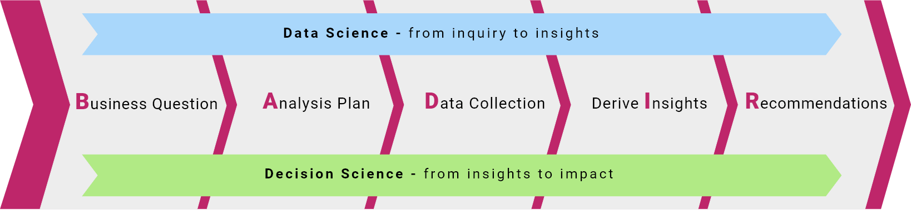

---
output:
  html_document:
    css: styles.css
---

```{r setup, include=FALSE}
knitr::opts_chunk$set(echo = TRUE)
```

```{r,echo=F,fig.align='center'}
knitr::include_graphics("pics/data_science_consulting_logo.png")
```

# Apresentação

A Ciência de Dados é um conjunto de metodologias e tecnologias focadas na **criação de valor** para um negócio. Nosso approach é embasado na metodologia [BADIR](https://aryng.com/aryng_BADIR_advantage), que inicia com a questão de negócios, passando por coleta, tratamento e análise, e termina com a comunicação e utilização dos insights:


```{r,echo=F,fig.align='center',out.width="80%"}

```

# Nossa empresa

Desde 2012, já atuamos em cerca de 20 projetos em Ciência de Dados no Brasil e exterior, tanto em R como Python. Focamos em identificação e validação de oportunidades e implantação de modelos preditivos e ferramentas de apoio à decisão (dashboards, live reports etc.). Também oferecemos [cursos de Ciência de Dados](cursos.html) para instituições de ensino e empresas.

# Equipe

Além de diretor Dan Reznik (PhD em Ciência da Computação pela UC-Berkeley), contamos com uma equipe de jovens cientistas de dados formados pelas melhores Universidades do país.

```{r,echo=F,fig.align='center'}

```

# Projetos

Atuamos tanto nas fases de planejamento estratégico quanto na execução, com equipe própria e/ou do cliente.

## Verticais e Clientes

- Setor Financeiro: Bradesco
- Consumer/Internet: Peixe Urbano, Gazeus Games
- Marketing Platforms: Bettrads, Fielo Loyalty
- Oil & Gas: Ouro Negro
- Healthcare: Amil UHG, Einstein, Fleury, Conexa Saúde.
- Governo: SEPLAG-MG, Secretaria de Educação-SP
- Startups: Instituto Igarapé, Loft, Loggi
  
## Produtos de Entrega

- Relatórios Analíticos
- Dashboards (Shiny e JS)
- Modelos preditivos (via API)

```{r,echo=F,fig.align='center'}

```

# Cursos de capacitação

Oferecemos cursos de capacitação de curta o média duração para empresas e instituições. Para mais informações, consultar [cursos de Ciência de Dados](cursos.html).


# Contato

Email: dreznik@gmail.com  
[LinkedIn](https://www.linkedin.com/in/dan-s-reznik-phd-bb49133/)  
Whatsapp: (21) 98574-7382

***

Atualização: May 2024.
